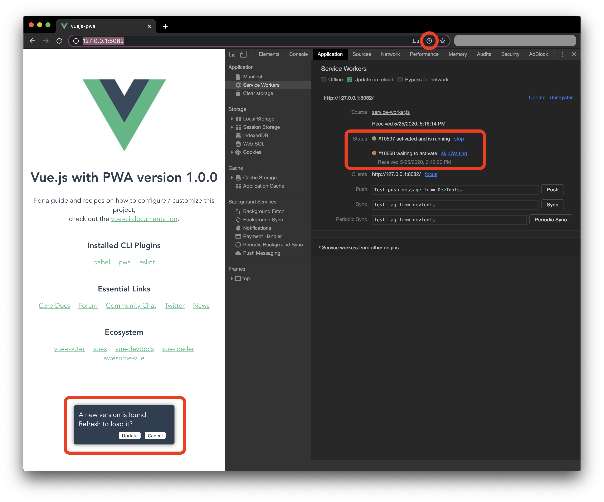

# 3 Steps to Add PWA to Vue.js in 2020



### Step 1: Setup project.

We will start with creating a Vue.js project by `vue create vuejs-pwa`. I select the features relevant to this article: `babel`, `PWA`, `CSS Pre-processors` and `Linter / Formatter`.

The go to solution for adding PWA functionalities is `@vue/cli-plugin-pwa`. As of writing this update, it uses `workbox-webpack-plugin` is `^4.3.1`, which enables interacting with service worker directly from main thread without extra work.

### Step 2: Configure PWA options.

We will create `vue.config.js` under root directory. Add the following:

```js
module.exports = {
  pwa: {
    themeColor: "#42b983",
    msTileColor: "#42b983",
    appleMobileWebAppCache: "yes",
    manifestOptions: {
      background_color: "#42b983"
    }
  }
};
```

Most of the options for PWA and workbox can be done here, and notice `manifestOptions.background_color` is used to set background color for the `background_color` field in `manifest.json`. This is not documented in https://cli.vuejs.org/core-plugins/pwa.html#configuration, which includes more configuration examples.

Also notice the two icon files `public/img/icons/android-chrome-maskable-192x192.png` and `public/img/icons/android-chrome-maskable-512x512.png`, as those are used to display [adaptive icons](https://web.dev/maskable-icon/).

### Step 3: Use service worker.

In `src/registerServiceWorker.js`, delete all lines and add the following:
```js
import { Workbox } from "workbox-window";

let wb;

if ("serviceWorker" in navigator) {
  wb = new Workbox(`${process.env.BASE_URL}service-worker.js`);

  wb.addEventListener("controlling", () => {
    window.location.reload();
  });

  wb.register();
} else {
  wb = null;
}

export default wb;
```

Then in `src/main.js`, delete the line `import './registerServiceWorker'`, and add the following:
```js
import wb from "./registerServiceWorker";

Vue.prototype.$workbox = wb;
```

Last in `src/App.vue`:
```js
created() {
  if (this.$workbox) {
    this.$workbox.addEventListener("waiting", () => {
      this.showUpdateUI = true;
    });
  }
}
```

And include UI to update to the new version, where the accept button listener of the UI does this:
```js
async accept() {
  this.showUpdateUI = false;
  await this.$workbox.messageSW({ type: "SKIP_WAITING" });
}
```

### How service worker is registered.
The service worker registration is done by `Workbox` class from `workbox-window`. It takes the path of the service worker file, again, with `process.env.BASE_URL` to ensure the service worker path is correct.

The technique showing here to allow user to update to a new version is adapted from [Offer a page reload for users](https://developers.google.com/web/tools/workbox/guides/advanced-recipes#offer_a_page_reload_for_users). To make sure the workbox is available everywhere in the app, it's added as an instance variable on `Vue`. It is available in `this` Vue context as `this.$workbox`. The code in `src/App.vue` uses workbox to prompt the update UI and reload the page.

I have created a repo where all codes are available. https://github.com/stetrevor/vuejs-pwa-demo.git

## Deploy the PWA

### Tryout service worker before deploy
Vue cli website doesn't suggest enabling service worker in `development` mode. By default `@vue/cli-plugin-pwa` uses a `noopServiceWorker.js` that reset any previous service worker registered for the same host:port combination. To see how service worker works, run the following command:

```sh
yarn build && cd dist && http-server && cd ..
```

You will need `http-server` to be installed as a global npm module using `npm` or `yarn`. This command builds for production, then serves the site with `http-server`, and you will be able to see the service worker in Chrome DevTools under `Application` tab. When hitting `Ctrl-C`, it will return back to the root folder.

Any time you made changes with your site, you can run this command to see how the service worker update dialog shows up and clicking on it reloads the page to the new version.

### Deploy to Github

If you deploy the app in a subdirectory, like a _\<username>.github.io/\<project-name>_, we need to configure `publicPath` in `vue.config.js` to be a relative path.

```js
module.exports = {
  publicPath: "./",

  pwa ...
}
```

Then `deploy.sh` can take care of deploying to Github.

Github repo for this demo: https://github.com/stetrevor/vuejs-pwa-demo.git.